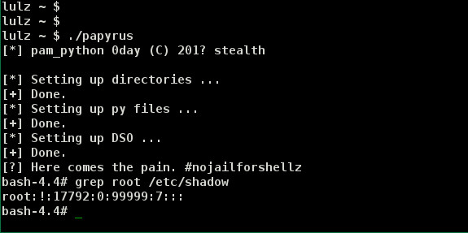

CVE-2019-16729 trickery and beyond
==================================


Intro
-----

When I was reading an article about customized PAM setups,
`pam_python` crossed my way. Having done quite some Python
code reviews in critical places and knowing that its very hard
to secure privileged Python code, I wondered how secure it could be.

Being a C and C++ coder with passion and hearing a lot of unsolicated
langsec rantings for using *such an insecure language* in 2019 coming
my way, let's take a rest and look why using a different programming languages does
not automatically make you secure. You might not suffer from buffer overflows
but you will still suffer on different problems where you wish it
would just be an off-by-one.
One may argue that this issue is within the C implementation of a binding,
but in my eyes it has to be seen in the broader context of making scripting
available everywhere and forgetting that the ease of use has hidden costs
underneath, which pay out if you use it at critical places.


The issue(s)
------------


After some first tests, it was clear that there was basically no
hardening done when invoking Python in an uid != euid context as
it happens when its called via an suid file across the PAM stack.
I wrote a dirty poc and soon realized that one month ago someone
else already had the same idea and that `CVE-2019-16729` was assigned
to this issue along with the following fix for `pam_python 1.0.7`:


```patch
@@ -85,6 +87,11 @@
 static void initialise_python(void)
 {
 #if	PY_MAJOR_VERSION*100 + PY_MINOR_VERSION >= 204
+  Py_DontWriteBytecodeFlag = 1;
+  Py_IgnoreEnvironmentFlag = 1;
+  /* Py_IsolatedFlag = 1; 		Python3 only */
+  Py_NoSiteFlag = 1;
+  Py_NoUserSiteDirectory = 1;
   Py_InitializeEx(0);
 #else
   size_t		signum;
```

and


```patch
@@ -2226,7 +2233,7 @@
     goto error_exit;
   }
   dot = strrchr(user_module_name, '.');
-  if (dot != 0 || strcmp(dot, ".py") == 0)
+  if (dot != 0 && strcmp(dot, ".py") == 0)
```

This aims to fix the issue of the Python interpreter loading DSO's from
users home directory or interpreting users environment during initialization
when invoked via PAM with an euid of 0.

Can this be sufficient? Maybe not. Python (as any other scripting language), is trying
way too hard to find module directories or platform dependent stuff on its own,
than you could turn off by setting some globals.

Digging into the Python 2.7 source, as this is what `pam_python` links to on
my test setups:


```C
 13 /* Search in some common locations for the associated Python libraries.
 14  *
 15  * Two directories must be found, the platform independent directory
 16  * (prefix), containing the common .py and .pyc files, and the platform
 17  * dependent directory (exec_prefix), containing the shared library
 18  * modules.  Note that prefix and exec_prefix can be the same directory,
 19  * but for some installations, they are different.
 20  *
 21  * Py_GetPath() carries out separate searches for prefix and exec_prefix.
 22  * Each search tries a number of different locations until a ``landmark''
 23  * file or directory is found.  If no prefix or exec_prefix is found, a
 24  * warning message is issued and the preprocessor defined PREFIX and
 25  * EXEC_PREFIX are used (even though they will not work); python carries on
 26  * as best as is possible, but most imports will fail.
 27  *
 28  * Before any searches are done, the location of the executable is
 29  * determined.  If argv[0] has one or more slashes in it, it is used
 30  * unchanged.  Otherwise, it must have been invoked from the shell's path,
 31  * so we search $PATH for the named executable and use that.  If the
 32  * executable was not found on $PATH (or there was no $PATH environment
 33  * variable), the original argv[0] string is used.
 34  *
 35  * Next, the executable location is examined to see if it is a symbolic
 36  * link.  If so, the link is chased (correctly interpreting a relative
 37  * pathname if one is found) and the directory of the link target is used.
 38  *
 39  * Finally, argv0_path is set to the directory containing the executable
 40  * (i.e. the last component is stripped).
 41  *
 42  * With argv0_path in hand, we perform a number of steps.  The same steps
 43  * are performed for prefix and for exec_prefix, but with a different
 44  * landmark.
 45  *
 46  * Step 1. Are we running python out of the build directory?  This is
 47  * checked by looking for a different kind of landmark relative to
 48  * argv0_path.  For prefix, the landmark's path is derived from the VPATH
 49  * preprocessor variable (taking into account that its value is almost, but
 50  * not quite, what we need).  For exec_prefix, the landmark is
 51  * Modules/Setup.  If the landmark is found, we're done.
 52  *
 53  * For the remaining steps, the prefix landmark will always be
 54  * lib/python$VERSION/os.py and the exec_prefix will always be
 55  * lib/python$VERSION/lib-dynload, where $VERSION is Python's version
 56  * number as supplied by the Makefile.  Note that this means that no more
 57  * build directory checking is performed; if the first step did not find
 58  * the landmarks, the assumption is that python is running from an
 59  * installed setup.
 60  *
 61  * Step 2. See if the $PYTHONHOME environment variable points to the
 62  * installed location of the Python libraries.  If $PYTHONHOME is set, then
 63  * it points to prefix and exec_prefix.  $PYTHONHOME can be a single
 64  * directory, which is used for both, or the prefix and exec_prefix
 65  * directories separated by a colon.
 66  *
 67  * Step 3. Try to find prefix and exec_prefix relative to argv0_path,
 68  * backtracking up the path until it is exhausted.  This is the most common
 69  * step to succeed.  Note that if prefix and exec_prefix are different,
 70  * exec_prefix is more likely to be found; however if exec_prefix is a
 71  * subdirectory of prefix, both will be found.
 72  *
 73  * Step 4. Search the directories pointed to by the preprocessor variables
 74  * PREFIX and EXEC_PREFIX.  These are supplied by the Makefile but can be
 75  * passed in as options to the configure script.
 76  *
 77  * That's it!
 78  *
 79  * Well, almost.  Once we have determined prefix and exec_prefix, the
 80  * preprocessor variable PYTHONPATH is used to construct a path.  Each
 81  * relative path on PYTHONPATH is prefixed with prefix.  Then the directory
 82  * containing the shared library modules is appended.  The environment
 83  * variable $PYTHONPATH is inserted in front of it all.  Finally, the
 84  * prefix and exec_prefix globals are tweaked so they reflect the values
 85  * expected by other code, by stripping the "lib/python$VERSION/..." stuff
 86  * off.  If either points to the build directory, the globals are reset to
 87  * the corresponding preprocessor variables (so sys.prefix will reflect the
 88  * installation location, even though sys.path points into the build
 89  * directory).  This seems to make more sense given that currently the only
 90  * known use of sys.prefix and sys.exec_prefix is for the ILU installation
 91  * process to find the installed Python tree.
 92  */
```

TL; DR: There are a lot of tricks going on inside the Python interpreter to
find so called **landmarks** in order to have the most efficient runtime when
it starts (there may be precompiled modules, bytecode, etc.).


Some definitions:

```C
 31 /* this is a wrapper around getenv() that pays attention to
 32    Py_IgnoreEnvironmentFlag.  It should be used for getting variables like
 33    PYTHONPATH and PYTHONHOME from the environment */
 34 #define Py_GETENV(s) (Py_IgnoreEnvironmentFlag ? NULL : getenv(s))
 35
```

```C
 669 static char *progname = "python";
 670
 671 void
 672 Py_SetProgramName(char *pn)
 673 {
 674     if (pn && *pn)
 675         progname = pn;
 676 }
 677
 678 char *
 679 Py_GetProgramName(void)
 680 {
 681     return progname;
 682 }
 683
```

Modules/getpath.c:
```C
107 static char prefix[MAXPATHLEN+1];
108 static char exec_prefix[MAXPATHLEN+1];
109 static char progpath[MAXPATHLEN+1];
110 static char *module_search_path = NULL;
111 static char lib_python[] = "lib/python" VERSION;

[...]

208 static void
209 copy_absolute(char *path, char *p)
210 {
211     if (p[0] == SEP)
212         strcpy(path, p);
213     else {
214         if (!getcwd(path, MAXPATHLEN)) {
215             /* unable to get the current directory */
216             strcpy(path, p);
217             return;
218         }
219         if (p[0] == '.' && p[1] == SEP)
220             p += 2;
221         joinpath(path, p);
222     }
223 }

[...]

240 static int
241 search_for_prefix(char *argv0_path, char *home)
242 {
243     size_t n;
244     char *vpath;
245
246     /* If PYTHONHOME is set, we believe it unconditionally */
247     if (home) {
248         char *delim;
249         strncpy(prefix, home, MAXPATHLEN);
250         delim = strchr(prefix, DELIM);
251         if (delim)
252             *delim = '\0';
253         joinpath(prefix, lib_python);
254         joinpath(prefix, LANDMARK);
255         return 1;
256     }
257
258     /* Check to see if argv[0] is in the build directory */
259     strcpy(prefix, argv0_path);
260     joinpath(prefix, "Modules/Setup");
261     if (isfile(prefix)) {
262         /* Check VPATH to see if argv0_path is in the build directory. */
263         vpath = VPATH;
264         strcpy(prefix, argv0_path);
265         joinpath(prefix, vpath);
266         joinpath(prefix, "Lib");
267         joinpath(prefix, LANDMARK);
268         if (ismodule(prefix))
269             return -1;
270     }
271
272     /* Search from argv0_path, until root is found */
273     copy_absolute(prefix, argv0_path);
274     do {
275         n = strlen(prefix);
276         joinpath(prefix, lib_python);
277         joinpath(prefix, LANDMARK);
278         if (ismodule(prefix))
279             return 1;
280         prefix[n] = '\0';
281         reduce(prefix);
282     } while (prefix[0]);
283
284     /* Look at configure's PREFIX */
285     strncpy(prefix, PREFIX, MAXPATHLEN);
286     joinpath(prefix, lib_python);
287     joinpath(prefix, LANDMARK);
288     if (ismodule(prefix))
289         return 1;
290
291     /* Fail */
292     return 0;
293 }

[...]

362 static void
363 calculate_path(void)
364 {
365     extern char *Py_GetProgramName(void);
366
367     static char delimiter[2] = {DELIM, '\0'};
368     static char separator[2] = {SEP, '\0'};
369     char *pythonpath = PYTHONPATH;
370     char *rtpypath = Py_GETENV("PYTHONPATH");
371     char *home = Py_GetPythonHome();
372     char *path = getenv("PATH");
373     char *prog = Py_GetProgramName();
374     char argv0_path[MAXPATHLEN+1];

[...]

413         else if (path) {
414                 while (1) {
415                         char *delim = strchr(path, DELIM);
416
417                         if (delim) {
418                                 size_t len = delim - path;
419                                 if (len > MAXPATHLEN)
420                                         len = MAXPATHLEN;
421                                 strncpy(progpath, path, len);
422                                 *(progpath + len) = '\0';
423                         }
424                         else
425                                 strncpy(progpath, path, MAXPATHLEN);
426
427                         joinpath(progpath, prog);
428                         if (isxfile(progpath))
429                                 break;
430
431                         if (!delim) {
432                                 progpath[0] = '\0';
433                                 break;
434                         }
435                         path = delim + 1;
436                 }
437         }
438         else
439                 progpath[0] = '\0';
440         if (progpath[0] != SEP && progpath[0] != '\0')
441                 absolutize(progpath);
442         strncpy(argv0_path, progpath, MAXPATHLEN);
443         argv0_path[MAXPATHLEN] = '\0';

[...]

479 #if HAVE_READLINK
480     {
481         char tmpbuffer[MAXPATHLEN+1];
482         int linklen = readlink(progpath, tmpbuffer, MAXPATHLEN);
483         while (linklen != -1) {
484             /* It's not null terminated! */
485             tmpbuffer[linklen] = '\0';
486             if (tmpbuffer[0] == SEP)
487                 /* tmpbuffer should never be longer than MAXPATHLEN,
488                    but extra check does not hurt */
489                 strncpy(argv0_path, tmpbuffer, MAXPATHLEN);
490             else {
491                 /* Interpret relative to progpath */
492                 reduce(argv0_path);
493                 joinpath(argv0_path, tmpbuffer);
494             }
495             linklen = readlink(argv0_path, tmpbuffer, MAXPATHLEN);
496         }
497     }
498 #endif /* HAVE_READLINK */
499
500     reduce(argv0_path);
501     /* At this point, argv0_path is guaranteed to be less than
502        MAXPATHLEN bytes long.
503     */
504
505     if (!(pfound = search_for_prefix(argv0_path, home))) {
506         if (!Py_FrozenFlag)
507             fprintf(stderr,
508                 "Could not find platform independent libraries <prefix>\n");
509         strncpy(prefix, PREFIX, MAXPATHLEN);
510         joinpath(prefix, lib_python);
511     }
512     else
513         reduce(prefix);
514

[...]

657 char *
658 Py_GetPath(void)
659 {
660     if (!module_search_path)
661         calculate_path();
662     return module_search_path;
663 }
```

Mentioned `Py_GetPath()` is eventually honoring `$PATH`. Thats probably all you need.
And it is not affected by any of the globals above. But there's more. The `progpath`
and `argv0_path` can be made empty strings, if `$PATH` is properly set (line 432 and 442).
The `readlink()` call will fail and `search_for_prefix()` will be called with empty
`argv0_path`. This will eventually trigger a `getcwd()` inside `copy_absolute()`, which
will append a `lib/python2.7` to the *cwd*. As nobody was calling `chdir()` all along,
this may still be `$HOME`. So you end up searching users home dir
for modules to load at startup again. As using the `site.so` DSO is disabled by
setting `Py_NoSiteFlag`, we just use another DSO to be loaded (for example
`encodings.so`).

For all this to happen you need to set a `$PATH` that does not exist, so that
`search_for_prefix()` will be called with empty `argv0_path` so that the *cwd* is
honored when searching for the **landmark** and voila!


Demo
----



